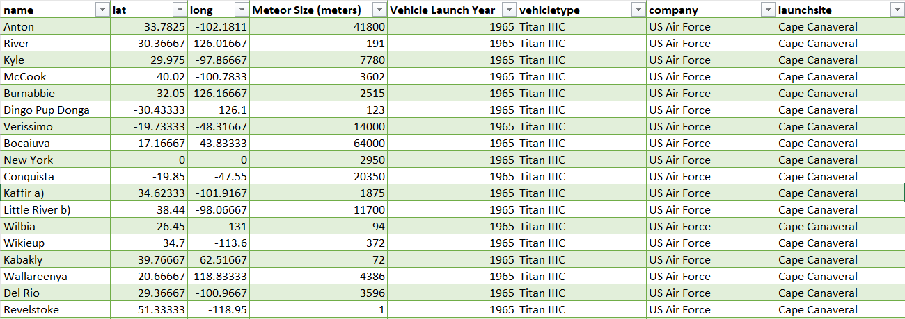

# Data Alliance For Science

# ELT-Project-Space-Launches-and-Meteorite Landings

 

## Project Proposal 

The proposal of this ETL is to extract data from a space launch data CSV and meteorite landing CSV, both from Kaggle. All this data will be transformed, centered around the launch date of each space craft, launched into a Postgres SQL, hoping to tell a story of space launches in relation to meteorite landings. 

## Data Sources 
   Our Data sources were from kaggle and are CSVs.  
   
  - [x]  Space Launches (Source 1):https://www.kaggle.com/rosetabares/spacemissionsflightstatus
   
  - [x]  Meteorite Landings (Source 2):https://www.kaggle.com/nasa/meteorite-landings

## Project Report

### Extract:

### Transform:

### Load:

### Conclusion:

**Additional Notes**
Please note this ETL was created with orginal thought.  

 
